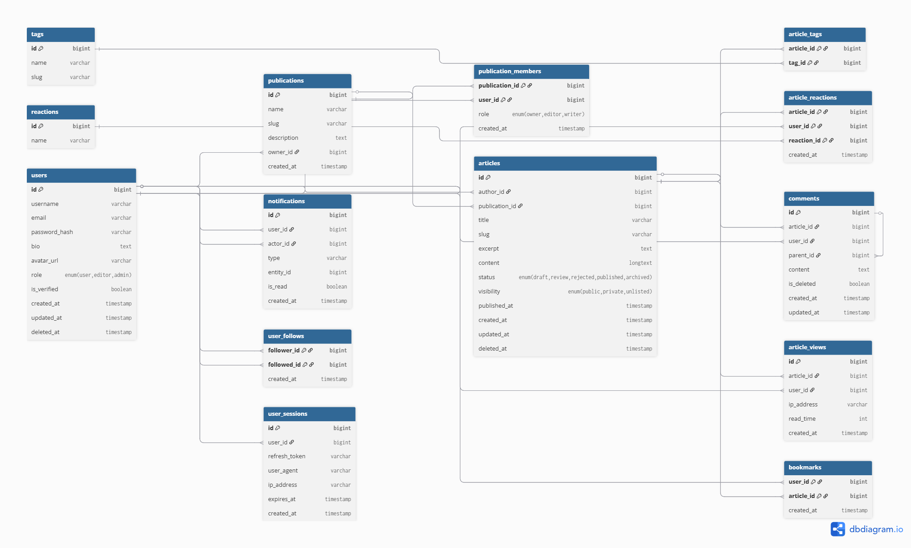

## Blog Platform API

A production-ready RESTful API built with **Node.js**, **Express**, and **MySQL** for managing a full-featured **blogging platform**, designed to be SEO-friendly and similar to **Dev.to** and **Medium.com**. The system enables users to **register, create posts, comment, react, bookmark, and follow other users or publications**. Admins and publication owners can efficiently manage **roles, tags, and content approval workflows**.

The API follows a **modular, scalable architecture** with robust **authentication**, **authorization**, **validation**, **testing**, and **documentation**, making it ideal for building high-performance, content-rich blogging platforms.

A production-ready RESTful API built with **Node.js**, **Express**, and **MySQL** for managing a full-featured **blogging platform**, designed to be SEO-friendly and similar to **Dev.to** and **Medium.com**. The system enables users to **register, create posts, comment, react, bookmark, and follow other users or publications**. Admins and publication owners can efficiently manage **roles, tags, and content approval workflows**.

The API follows a **modular, scalable architecture** with robust **authentication**, **authorization**, **validation**, **testing**, and **documentation**, making it ideal for building high-performance, content-rich blogging platforms.


[](https://nodejs.org/)
[](https://expressjs.com/)
[](https://www.mysql.com/)
[](https://jwt.io/)
[](https://github.com/colinhacks/zod)
[](https://github.com/visionmedia/supertest)


---

## Key Features

- JWT-based authentication and authorization
- Role-based access control (User, Editor, Owner, Admin)
- User management (profile, followers/following, notifications)
- Article and publication management (CRUD)
- Commenting system with nested routes
- Article reactions and views tracking
- Bookmarking system
- Tag management (Admin only)
- Publication membership and approval workflows
- Request validation using Zod
- Automated API testing with Jest and Supertest

---

## Tech Stack

- **Runtime:** Node.js
- **Framework:** Express.js
- **Database:** MySQL / MariaDB
- **Authentication:** JWT
- **Validation:** Zod
- **Testing:** Jest, Supertest

---

## Prerequisites

- Node.js v18 or higher
- MySQL or MariaDB v10 or higher
- npm (comes with Node.js)

---

## Installation

### 1. Clone the Repository

```bash
git clone https://github.com/imranmalakzai/blog-api
cd blog-api
```

### 2. Install Dependencies

```bash
npm install
```

### 3. Environment Configuration

fill the example `.env.development.local` file in the project root:

```
HOST_URI="localhost"
DB_password=""
DB_NAME="blog_api"
DB_USER="root"
CORS_ORIGIN="*"
PORT=5000
ACCESS_TOKEN="your_access_token"
ACCESS_TOKEN_EXPIRE='1h'
REFRESH_TOKEN="your_refresh_token"
REFRESH_TOKEN_EXPIRE='7d'

```

### 4. Database Setup

1. Open your MySQL client (Workbench, phpMyAdmin, etc.)
2. Locate the SQL schema file inside the `schema` directory
3. Execute the SQL script to create tables

### 5. Start the Application

```bash
npm run start
```

Run automated tests:

```bash
npm run test
```

---

## API Access

- **Base URL:** `http://localhost:5000/api`

---

## Authentication

- `POST /api/auth/register` — Register a new user
- `POST /api/auth/login` — User login
- `POST /api/auth/logout` — Logout current user
- `POST /api/auth/refresh` — Refresh access token

---

## Users

### Current User (`/users/me`) _(Auth required)_

- `GET /api/users/me` — Get current user profile
- `PATCH /api/users/me` — Update profile
- `PATCH /api/users/me/avatar` — Update profile avatar
- `PATCH /api/users/me/password` — Change password
- `DELETE /api/users/me` — Delete account
- `GET /api/users/me/followers` — Get my followers
- `GET /api/users/me/following` — Get users I am following

### Notifications _(Auth required)_

- `GET /api/users/me/notifications` — Get all notifications
- `GET /api/users/me/notifications/:notificationId/read` — Read a notification
- `POST /api/users/me/notifications/read-all` — Mark all notifications as read
- `DELETE /api/users/me/notifications/:notificationId` — Delete a notification

### Other Users

- `GET /api/users` — Get all users
- `GET /api/users/@:username` — Get user by username
- `GET /api/users/@:username/articles` — Get articles by a user
- `GET /api/users/@:username/followers` — Get user followers
- `GET /api/users/@:username/following` — Get users the user follows
- `POST /api/users/@:username/follow` — Follow a user
- `DELETE /api/users/@:username/follow` — Unfollow a user
- `GET /api/users/@:username/articles/:articleSlug` — Get a specific article by slug

### Admin Only

- `PATCH /api/users/@:username/role` — Change user role
- `GET /api/users/role?role=user|editor|admin` — Get users by role

---

## Articles

- `POST /api/articles` — Create a new article _(Auth required)_
- `GET /api/articles` — Get all articles
- `GET /api/articles/:articleSlug` — Get article by slug
- `PATCH /api/articles/:articleSlug` — Update an article _(Auth required)_
- `DELETE /api/articles/:articleSlug` — Delete an article _(Auth required)_

### Nested Endpoints

- `/api/articles/:articleSlug/comments` — Article comments
- `/api/articles/:articleSlug/reactions` — Article reactions
- `/api/articles/:articleSlug/views` — Article views

---

## Article Reactions

- `POST /api/articles/:articleSlug/reactions` — React to an article _(Auth required)_
- `GET /api/articles/:articleSlug/reactions` — Get all reactions for an article

---

## Article Views

- `GET /api/articles/:articleSlug/views` — Get total views for an article

---

## Bookmarks _(Auth required)_

- `POST /api/bookmarks/articles/:articleSlug` — Bookmark an article
- `GET /api/bookmarks/articles/:articleSlug` — Get a bookmarked article
- `DELETE /api/bookmarks/articles/:articleSlug` — Remove a bookmarked article
- `GET /api/bookmarks` — Get all bookmarked articles

---

## Comments

- `POST /api/articles/:articleSlug/comments` — Create a comment
- `GET /api/articles/:articleSlug/comments` — Get all comments for an article
- `GET /api/articles/:articleSlug/comments/:commentId` — Get a specific comment
- `PATCH /api/articles/:articleSlug/comments/:commentId` — Update a comment
- `DELETE /api/articles/:articleSlug/comments/:commentId` — Delete a comment

---

## Publications

- `POST /api/publications` — Create a new publication _(Auth required)_
- `GET /api/publications` — Get all publications
- `GET /api/publications/:publicationSlug` — Get a publication by slug
- `PATCH /api/publications/:publicationSlug` — Update a publication _(Auth required)_
- `DELETE /api/publications/:publicationSlug` — Delete a publication _(Auth required)_

### Nested Endpoints

- `/api/publications/:publicationSlug/articles` — Publication articles
- `/api/publications/:publicationSlug/members` — Publication members

---

## Publication Articles

- `GET /api/publications/:publicationSlug/articles` — Get all articles in a publication
- `GET /api/publications/:publicationSlug/articles/:articleSlug` — Get a specific article
- `POST /api/publications/:publicationSlug/articles` — Create a new article _(Owner, Editor, Writer; Auth required)_
- `PATCH /api/publications/:publicationSlug/articles/:articleSlug` — Update article content _(Owner, Editor, Writer; Auth required)_
- `DELETE /api/publications/:publicationSlug/articles/:articleSlug` — Delete an article _(Owner, Writer; Auth required)_

### Review Articles

- `GET /api/publications/:publicationSlug/review-articles` — Get all articles under review _(Owner, Editor)_
- `PATCH /api/publications/:publicationSlug/review-articles/:articleSlug/approve` — Approve/Publish an article _(Owner, Editor)_
- `PATCH /api/publications/:publicationSlug/review-articles/:articleSlug/reject` — Reject an article _(Owner, Editor, Writer)_

### Nested Endpoints

- `/api/publications/:publicationSlug/articles/:articleSlug/comments` — Article comments
- `/api/publications/:publicationSlug/articles/:articleSlug/reactions` — Article reactions
- `/api/publications/:publicationSlug/articles/:articleSlug/views` — Article views

---

## Publication Members

- `POST /api/publications/:publicationSlug/follow` — Follow a publication _(Auth required)_
- `DELETE /api/publications/:publicationSlug/follow` — Unfollow a publication _(Auth required)_
- `GET /api/publications/:publicationSlug/followers` — Get all followers of a publication _(Auth required)_
- `GET /api/publications/:publicationSlug/members` — Get all members of a publication _(Auth required)_
- `DELETE /api/publications/:publicationSlug/members/:username` — Remove a member _(Owner only; Auth required)_
- `PATCH /api/publications/:publicationSlug/members/:username` — Change a member's role _(Owner only; Auth required)_

---

## Tags

- `POST /api/tags` — Create a tag _(Admin only)_
- `GET /api/tags` — Get all tags
- `GET /api/tags/:slug` — Get tag by slug
- `PATCH /api/tags/:slug` — Update a tag
- `DELETE /api/tags/:slug` — Delete a tag _(Admin only)_

---

## Reactions _(Admin only for create/update/delete)_

- `GET /api/reactions` — Get all reactions
- `GET /api/reactions/:reactionId` — Get a reaction by ID
- `POST /api/reactions` — Create a new reaction
- `POST /api/reactions/:reactionId` — Update a reaction
- `DELETE /api/reactions/:reactionId` — Delete a reaction

## API Documentation Preview



---

## License

This project is licensed under the **MIT License**.
See the [LICENSE](LICENSE) file for more information.
